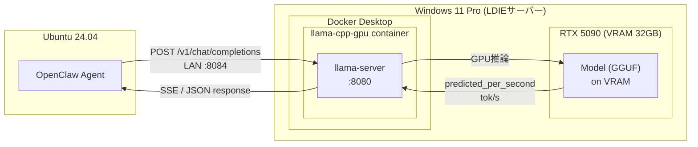
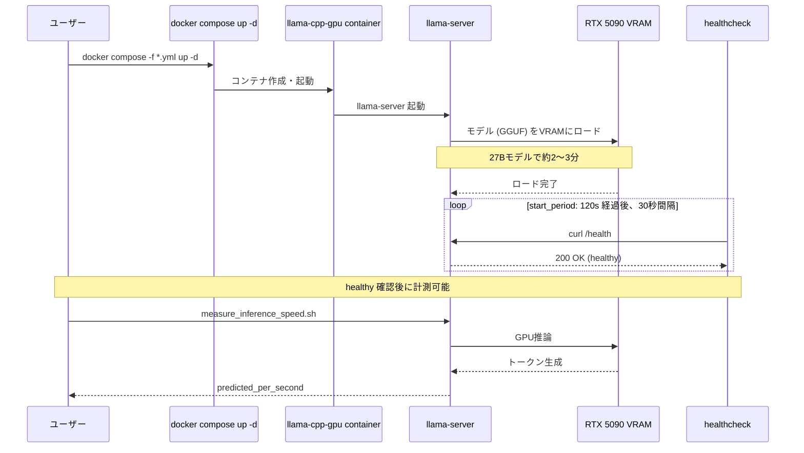

# Parameter Tuning: ベースライン計測と調査記録

## 環境

- GPU: NVIDIA GeForce RTX 5090 (VRAM 32GB, WDDM)
- CPU: Intel Core i5-12400 (6コア12スレッド)
- RAM: DDR4
- Case: CORSAIR 7000D AIRFLOW
- PSU: CORSAIR HX1500i (1500W)
- OS: Windows 11 Pro
- llama.cpp: server-cuda (Docker image: ghcr.io/ggml-org/llama.cpp:server-cuda, built 2026-03-03, sha256:273ed74d3164)
- 計測期間: 2026-03-28 03:00 〜 16:00

## 全体構成


## 起動フロー


## 計測方法

### 前提条件

- OllamaなどのGPUを消費するプロセスを停止すること（VRAMを消費し計測結果に影響する）
- 他のGPU負荷の高いプロセスが無いことを `nvidia-smi` で確認

```bash
nvidia-smi
```

Processes セクションに `C` (Compute) タイプのプロセスがないことを確認する。
`C+G` (Compute+Graphics) はWindows UIの通常プロセスなので問題ない。

```
# NG例: Ollama が VRAM を消費している
|    0   N/A  N/A   32748      C   ...Ollama\ollama.exe   N/A  |

# OK例: C+G のみ（Windows UI通常プロセス）
|    0   N/A  N/A   10580    C+G   C:\Windows\explorer.exe  N/A  |
```

また、Memory-Usage が llama.cpp 起動前の状態で過大でないことも確認する。
アイドル時の目安: 1〜2GB 程度（Windowsデスクトップのみ）。

### 起動完了確認

docker-compose で起動後、llama.cpp はモデルをVRAMにロードする必要がある。
ロード完了前にリクエストを送っても正常な計測ができないため、ヘルスチェックで起動完了を待つ。

```bash
# コンテナのヘルスチェックが healthy になるまでポーリング（5秒間隔、最大200秒）
for i in $(seq 1 40); do
  status=$(docker inspect --format='{{.State.Health.Status}}' ldie_infra_docker-llama-cpp-gpu-1 2>/dev/null)
  echo "$i: $status"
  if [ "$status" = "healthy" ]; then echo "READY"; break; fi
  sleep 5
done
```

docker-compose.yml の `healthcheck` が `/health` エンドポイントに curl を送り、
llama.cpp がリクエスト受付可能になると `healthy` に遷移する。
`start_period: 120s` の間はヘルスチェック失敗をカウントしない（モデルロード猶予）。

### 速度計測

```bash
bash LDIE_TEST_Req/measure_inference_speed.sh [PORT]
# → "Hello" プロンプト, max_tokens=50, predicted_per_second を取得
```

`[PORT]` は `.env` の `DOCKER_HOST_PORT_LLAMA` に設定したホスト側公開ポート番号。
docker-compose ファイルごとのデフォルトポートは [ポート構成](../openclaw-integration/02_network_config.md#ポート構成) を参照。

## テスト対象モデル

| モデル | ファイル | サイズ | アーキテクチャ |
|---|---|---|---|
| Qwen3-Coder-30B | Qwen3-Coder-30B-A3B-Instruct-Q4_K_M.gguf | 18GB | MoE (30B/3B active) |
| Gemma 3 27B | gemma-3-27b-it-Q4_K_M.gguf | 16GB | Dense |
| Qwen3.5-27B | Qwen3.5-27B-Q4_K_M.gguf | 16GB | Dense |

## 構成パラメータ比較

### docker-compose.yml と docker-compose.high.yml の差分

| パラメータ | 標準GPU | High | 備考 |
|---|---|---|---|
| ctx-size | 32768 | **65536** | .envで上書き可能 |
| batch-size | (デフォルト) | **4096** | |
| ubatch-size | (デフォルト) | **2048** | |
| threads | 8 | **24** | i5-12400は12スレッドなので24は過剰 |
| threads-batch | (デフォルト) | **24** | |
| parallel | 4 | **16** | |
| port | 8081 | 8083 | |

### .env による実効パラメータ

標準GPU/High共に .env の値が docker-compose のデフォルト値を上書きする。
計測時の .env 設定: `LLAMA_CTX_SIZE=8192`, `LLAMA_N_PARALLEL=2`

**重要:** 標準GPU構成で以前計測した 110/67/56 tok/s の時の .env は保存されていない。
現在の .env (ctx=8192, parallel=2) とは異なる可能性がある。

---

## 計測結果

全計測結果を以下のフォーマットで統一して記録する。

| # | 時刻 | compose file | port | モデル | ctx_size | parallel | threads | Ollama | tok/s | 備考 |
|---|---|---|---|---|---|---|---|---|---|---|
| - | 03-27以前 | 不明 | 不明 | Qwen3-Coder-30B | 不明 | 不明 | 不明 | 不明 | 110 | 条件未記録、参考値 |
| - | 03-27以前 | 不明 | 不明 | Gemma 3 27B | 不明 | 不明 | 不明 | 不明 | 67 | 条件未記録、参考値 |
| - | 03-27以前 | 不明 | 不明 | Qwen3.5-27B | 不明 | 不明 | 不明 | 不明 | 56 | 条件未記録、参考値 |
| 1 | 03-28 03:00 | high.yml | 8083 | Qwen3-Coder-30B | 8192 | 2 | 24 | 稼働中 | 2.18 | .envがctx/parallelを上書き |
| 2 | 03-28 03:00 | high.yml | 8083 | Gemma 3 27B | 8192 | 2 | 24 | 稼働中 | 8.27 | 同上 |
| 3 | 03-28 03:00 | high.yml | 8083 | Qwen3.5-27B | 8192 | 2 | 24 | 稼働中 | 20.69 | 同上 |
| 4 | 03-28 14:00 | high.yml | 8083 | Qwen3-Coder-30B | 8192 | 2 | 24 | 稼働中 | 2.26 | ファン設定修正後 |
| 5 | 03-28 14:00 | high.yml | 8083 | Gemma 3 27B | 8192 | 2 | 24 | 稼働中 | 7.86 | 同上 |
| 6 | 03-28 14:00 | high.yml | 8083 | Qwen3.5-27B | 8192 | 2 | 24 | 稼働中 | 19.24 | 同上 |
| 7 | 03-28 15:00 | high.yml | 8083 | Qwen3.5-27B | 65536 | 16 | 24 | 稼働中 | 19.24 | .env上書きなし (highデフォルト) |
| 8 | 03-28 15:00 | high.yml | 8083 | Qwen3.5-27B | 65536 | 16 | **12** | 稼働中 | 19.84 | threads変更テスト |
| 9 | 03-28 15:10 | high.yml | 8083 | Qwen3.5-27B | 65536 | **4** | 12 | 稼働中 | 19.69 | parallel変更テスト |
| 10 | 03-28 15:15 | high.yml | 8083 | Qwen3.5-27B | **32768** | 4 | 12 | 稼働中 | 20.17 | ctx変更テスト |
| 11 | 03-28 15:20 | high.yml | 8083 | Qwen3.5-27B | **8192** | 4 | 12 | 稼働中 | 19.71 | ctx変更テスト |
| 12 | 03-28 15:45 | docker-compose.yml | 8081 | Qwen3.5-27B | 8192 | 2 | 8 | **停止** | **57.50** | Ollama停止で大幅改善 |
| 13 | 03-28 15:50 | docker-compose.yml | 8081 | Qwen3-Coder-30B | 8192 | 2 | 8 | 停止 | 2.17 | 以前の110と乖離、原因不明 |
| 14 | 03-28 16:00 | high.yml | 8083 | Qwen3.5-27B | 8192 | 2 | 24 | 停止 | 20.63 | |
| 15 | 03-28 16:05 | high.yml | 8083 | Gemma 3 27B | 8192 | 2 | 24 | 停止 | 8.10 | |
| 16 | 03-28 16:10 | high.yml | 8083 | Qwen3-Coder-30B | 8192 | 2 | 24 | 停止 | 2.24 | |
| 17 | 03-28 16:50 | agents.yml | 8084 | Qwen3.5-27B | 16384 | 4 | 8 | 停止 | 20.11 | |
| 18 | 03-28 16:55 | agents.yml | 8084 | Qwen3.5-27B | 8192 | 4 | 8 | 停止 | 20.22 | |
| 19 | 03-28 17:00 | agents.yml | 8084 | Qwen3.5-27B | 8192 | 2 | 8 | 停止 | 20.13 | |
| 20 | 03-28 17:05 | docker-compose.yml | **8084** | Qwen3.5-27B | 8192 | 2 | 8 | 停止 | 20.01 | .envのport=8084のまま起動 |

### 計測結果の分析

- **#12 のみ 57.50 tok/s** が出ており、他の全計測は 20 tok/s 前後
- #12 と #20 は同じ docker-compose.yml、同じモデル、同じ .env パラメータだが結果が異なる
- #12 と #20 の差異: ポート (8081 vs 8084)、計測時刻、ブラウザ/Thunderbird の起動有無
- **#1〜#11 は Ollama 稼働中だが、Ollama 停止後の #14〜#20 も 20 tok/s 前後で変わらない**
- **#12 の 57.50 tok/s が異常値（外れ値）の可能性がある**

---

## 判明した事実

### 1. Ollamaの影響

- OllamaがバックグラウンドでGPU VRAMを消費していた
- Ollama停止により Qwen3.5-27B は 19→57 tok/s に回復
- **計測時にはOllamaを必ず停止すること**

### 2. ファン問題との関係

- 初回計測時(03:00) GPUファン 0%、GPU温度 49°C
- ファン設定修正後(14:00)の再計測で結果はほぼ同一
- → **ファン停止は速度低下の原因ではなかった**（短時間の計測ではスロットリング温度に達しない）
- ただし長時間推論ではファン停止は危険なため、設定修正は必要だった

### 3. Qwen3-Coder-30B の異常な遅さ

- 標準GPU構成でも 2.17 tok/s（以前は 110 tok/s）
- Ollama停止後でも改善なし
- 考えられる原因:
  - 以前の110 tok/sは異なる.env設定（ctx_size, parallel等）で計測された可能性
  - MoEモデル特有の挙動（ctx_size=8192でもKVキャッシュが大きい？）
  - Docker imageのバージョン変更
  - **以前の計測条件が記録されていないため検証不能**

### 4. High構成の速度低下

- Qwen3.5-27B: 標準GPU 57.5 → High 20.6 (約36%に低下)
- パラメータ個別テスト（Ollama稼働下）では threads/ctx/parallel 単体の変更で改善なし
- **Ollama停止後のパラメータ個別テストは未実施**

---

## 未解決課題

1. **Qwen3-Coder-30Bが2 tok/sしか出ない原因の特定**
   - 以前の110 tok/s計測時の.env設定が不明
   - Ollama無しの環境でパラメータを変えて再検証が必要

2. **Ollama停止後のパラメータ個別テスト**
   - High構成の速度低下原因をOllamaの影響なしで特定する必要がある

3. **Gemma 3 27Bの標準GPUベースライン再計測**
   - Ollama無しでの正確な値が未取得

4. **計測条件の標準化**
   - 今後の計測では以下を必ず記録・統一する:
     - Ollama停止確認
     - .env の全パラメータ
     - 使用する docker-compose ファイル
     - nvidia-smi のVRAM使用量

---

## ファン制御設定（本調査中に実施）

### 最終構成

| ソフト | 対象 | 自動起動 |
|---|---|---|
| MSI Afterburner | GPUファン (RTX 5090) | Windows起動時 ✓ |
| FanControl (Rem0o V264) | CPUファン + ケースファン6基 | ログオン時 ✓ |

### Afterburner GPU ファンカーブ

- ケーブル障害（ATX 24pin電源ケーブルがエアフロー阻害）を考慮した強めの設定
- Hysteresis: 3°C
- Override zero fan speed with hardware curve: 有効

### FanControl

- CPU Fan Curve: Core Max温度連動、ケーブル障害考慮の強め設定
- Case Fan Curve: Core Max温度連動、ケーブル障害考慮の強め設定
- ケースファン6基はPWM Fan Hubで1チャネルに統合（個別制御不可）
